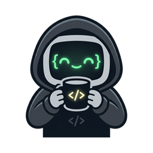

# Vesteganahuiyaa

<p align="center">
  
</p>

Accountability and healthy-focus companion for VS Code. Set one mission, watch its deadline, and get called out (nicely) if you drift.

## Status

Early scaffold — first vertical slice only:

- `Vesteganahuiyaa: Create Mission` — asks for a mission name and a future deadline.
- Active mission is shown in the status bar (name + time remaining) and survives closing/reopening VS Code.
- `Vesteganahuiyaa: Complete Mission` — marks the active mission done, records whether it was on time.
- `Vesteganahuiyaa: Open Dashboard` — placeholder until the full webview dashboard lands.
- `Vesteganahuiyaa: Reset Local Data` — wipes local mission data (confirmation required).

No focus timer, break reminders, or dashboard UI yet — see `PRD.md` for the full spec and milestone order.

## Data & privacy

Everything is stored locally via VS Code's `globalState`. Nothing leaves your machine — no accounts, no network calls, no telemetry.

## Development

```bash
npm install
npm run compile   # or: npm run watch
```

Then press `F5` in VS Code to launch an Extension Development Host.

## Package

```bash
npm run package   # produces a .vsix via vsce
```
